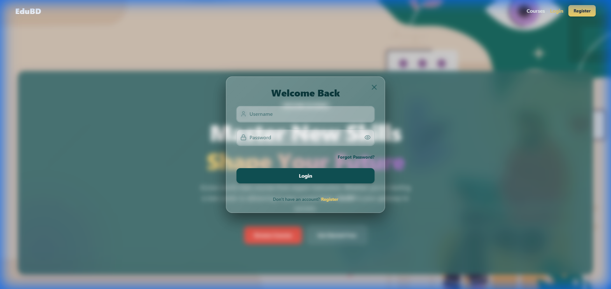
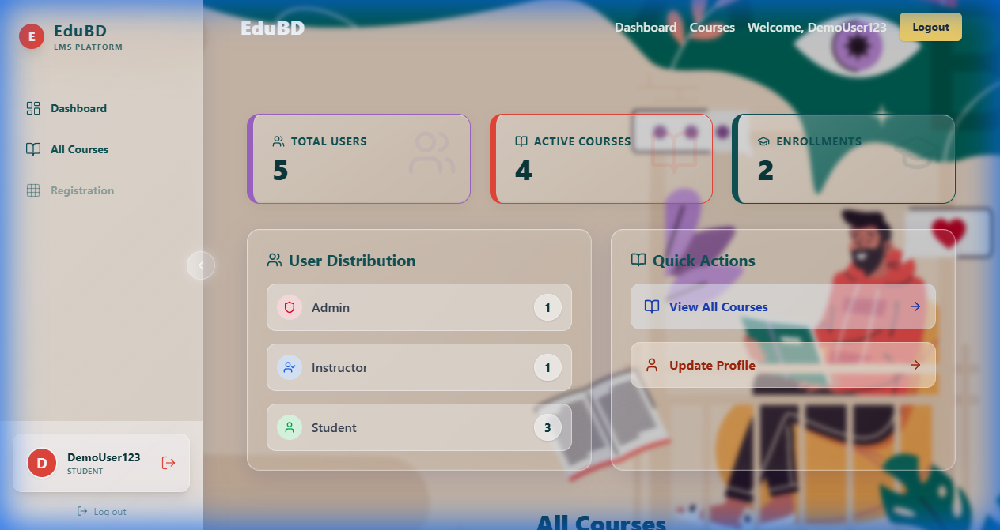
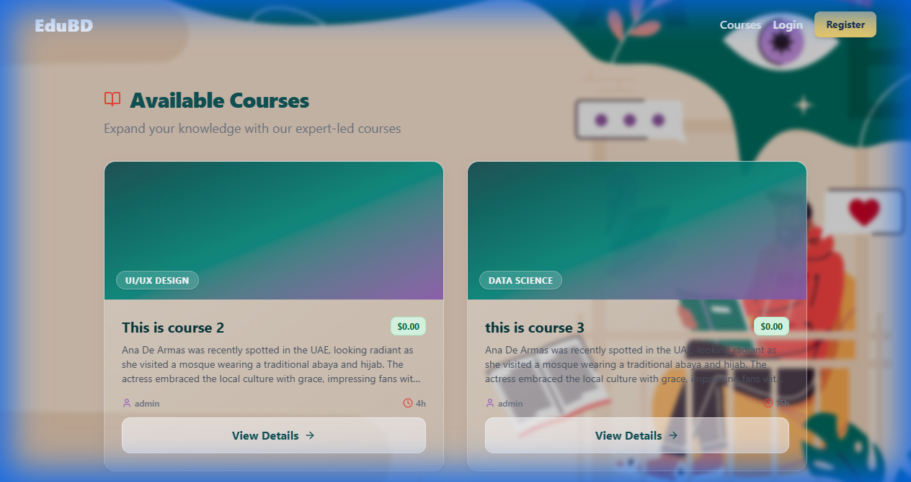

# EduBD - Modern Learning Management System

EduBD is a state-of-the-art Learning Management System (LMS) designed to provide a seamless, engaging, and premium educational experience. Built with a robust Django backend and a dynamic React frontend, it features a "Liquid Glass" UI design that emphasizes aesthetics and user interaction.

## 🚀 Features

-   **Authentication & Security**: Secure JWT-based authentication with role-based access control (Student, Instructor, Admin).
-   **Course Management**:
    -   Browse available courses with advanced filtering.
    -   Detailed course views with enrollment capabilities.
    -   Instructor tools for creating and editing courses.
-   **User Dashboard**: Personalized dashboard showing enrolled courses and progress.
-   **Admin Controls**: Comprehensive User Management interface for administrators.
-   **Modern UI/UX**:
    -   Liquid Glass morphism design system.
    -   Responsive layout with collapsible sidebar.
    -   Smooth page transitions (SPA feel).
    -   Global notifications (Toasts).

## 🛠️ Tech Stack

### Frontend
-   **Framework**: React (Vite)
-   **Styling**: Tailwind CSS (with custom Glassmorphism utilities)
-   **Icons**: Lucide React
-   **Animations**: Framer Motion & Custom CSS Keyframes
-   **State Management**: React Context API
-   **Routing**: React Router DOM

### Backend
-   **Framework**: Django & Django REST Framework (DRF)
-   **Database**: SQLite (Development)
-   **Authentication**: Simple JWT
-   **CORS**: Django CORS Headers

## 📸 Screenshots

### Login Page


### Dashboard


### Course Catalog


## 🏗️ Setup Instructions

### Prerequisites
-   Node.js (v16+)
-   Python (v3.8+)

### 1. Backend Setup
```bash
# Navigate to project root
cd LMS02

# Create virtual environment
python -m venv venv

# Activate virtual environment
# Windows:
.\venv\Scripts\activate
# Mac/Linux:
# source venv/bin/activate

# Install dependencies
pip install -r requirements.txt

# Run migrations
python manage.py migrate

# Start server
python manage.py runserver
```

### 2. Frontend Setup
```bash
# Navigate to frontend directory
cd frontend

# Install dependencies
npm install

# Start development server
npm run dev
```

The application will be available at `http://localhost:5173`.

---

© 2025 EduBD. All rights reserved.
